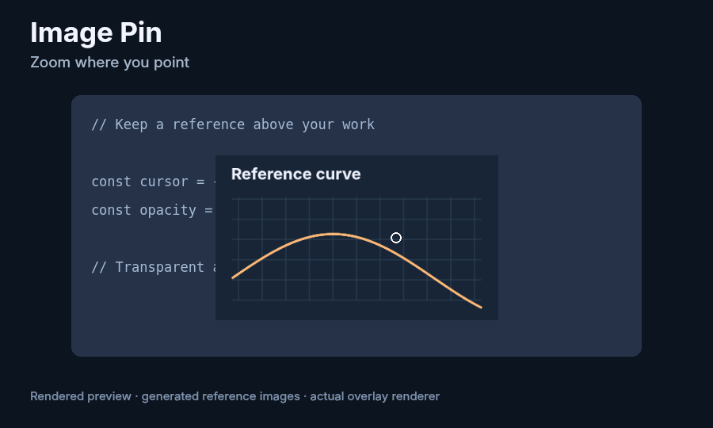

# Image Pin

Keep screenshots and reference images above your Linux apps. Drag them directly,
zoom at the cursor, and adjust opacity without switching windows.



*Rendered at 50 fps with scripted input and generated images on the actual
overlay renderer. It is not a recording of a private desktop.
[Watch the full-color video](docs/assets/demo.mp4).*

Image Pin consists of a **Vicinae extension** and a small **local Linux helper**.
It also works from the command line. It is not a Raycast extension or a GNOME
Shell extension.

## Features

- Capture a screen region and pin it immediately.
- Pin a clipboard image or an existing image file.
- Move an image by dragging it. You can scroll to resize while holding it.
- Zoom around the cursor, keeping the image point under it fixed.
- Adjust each image's opacity with a slider or Alt+scroll.
- Keep multiple images open; clicking one brings it above the others.
- Lock position and size, restore original size, copy, save, or close.
- Recover off-screen images with **Bring Pins into View**.
- English and Korean menus, selected through extension preferences.

## Supported environment

Tested on **Ubuntu 24.04, GNOME 46, Wayland with XWayland, x86-64,
Python 3.12 and Vicinae 0.27.3**. The overlay requires X11 SHAPE 1.1.

Other desktop environments, native Wayland-only sessions, macOS and Windows
have not been validated. Capture currently uses GNOME Screenshot. The helper
needs a graphical desktop session, including when invoked over SSH.

## Install

Install [Vicinae](https://docs.vicinae.com/), [uv](https://docs.astral.sh/uv/getting-started/installation/),
and Node.js 22 or later with npm. On Ubuntu, install the native dependencies:

```zsh
sudo apt install gnome-screenshot libx11-6 libxext6 libxkbcommon-x11-0 libxcb-xinerama0
```

Then clone this source repository and run the installer:

```zsh
git clone https://github.com/jinkim0823/image-pin.git
cd image-pin
./install.sh
```

The checkout can live anywhere, including a path containing spaces. The
installer creates the project's uv environment, installs the locked Node
dependencies, builds the extension and adds `~/.local/bin/image-pin` as a link
to the helper. Keep the checkout in place while installed.

No Vicinae restart is required. Search for one of these commands:

| Command | Action |
| --- | --- |
| **Capture & Pin** | Select a screen region and pin it |
| **Pin Clipboard Image** | Pin a copied image or a copied local image file |
| **Pin Image File** | Choose an image file |
| **Close All Pins** | Close every pinned image |
| **Bring Pins into View** | Bring images back to the current monitor |

On desktops supported by Vicinae's global-shortcut backend, set a command
hotkey through Vicinae. On GNOME Wayland, use **Settings → Keyboard → View and
Customize Shortcuts → Custom Shortcuts** instead. For example, bind
**Super+Shift+P** to this command (use the absolute path to `vicinae` if it is
not on the desktop session's PATH):

```zsh
vicinae cmd launch @jinkim0823/image-pin:capture
```

The **Add Alias** field in Vicinae settings is a search keyword, not a keybinding.
The installer does not assign or replace desktop shortcuts automatically.
See [Vicinae global-shortcut support](https://docs.vicinae.com/global-shortcuts).

In extension preferences,
**Helper executable** defaults to `~/.local/bin/image-pin`. If using a custom
install directory, change that preference to the absolute executable path.
**Language** can follow the system, use English, or use Korean.

## Controls

| Input | Action |
| --- | --- |
| Left-button drag | Move the image |
| Scroll | Zoom at the cursor |
| Shift+scroll | Fine zoom |
| Alt+scroll | Increase or decrease opacity |
| Right-click | Copy, save, original size, lock, opacity slider, close |
| Double-click | Restore original size |
| Ctrl+C | Copy the selected image at its original resolution |
| Esc | Close the selected image and return keyboard focus |

Opacity ranges from 10% to 100%, so a pin cannot become completely invisible.
Locking prevents movement and zoom; opacity remains adjustable. Copy and Save
always use the original image rather than the displayed size or opacity.

## Command line

```zsh
~/.local/bin/image-pin capture
~/.local/bin/image-pin clipboard
~/.local/bin/image-pin file '/path/to/reference.png'
~/.local/bin/image-pin reveal
~/.local/bin/image-pin close-all
~/.local/bin/image-pin shutdown
```

Add `--language en` or `--language ko` to override the system language.
The helper starts on demand and stays resident after Vicinae closes. It is not
started automatically at login. Images are not restored after helper shutdown.
Updating the source takes effect after restarting the helper; close or save
pins before doing so.

## Privacy and implementation

Image Pin makes no network requests during use. Screenshots are loaded from
private temporary files that are removed after loading. Area capture first
freezes the desktop, then lets you drag a region on that snapshot. The full
snapshot is discarded after selection or cancellation; only the selected
image remains pinned. Images otherwise stay in memory unless you explicitly
save them. Copying uses the system clipboard;
your clipboard manager may retain copied images under its own settings.

Captured images stay exactly over the selected region, regardless of drag
direction, with a thin gray frame marking the pin. Clipboard and file pins
appear beside the pointer in X11 sessions. Under Wayland, XWayland cannot see
the pointer over Wayland windows, so they cascade from the primary screen's
center instead.

The renderer uses one transparent desktop-sized surface. Zoom and drag change
image transforms inside that surface, leaving its native geometry unchanged.
Only the image rectangles accept pointer input; transparent areas pass clicks
through to the apps below. This avoids repeatedly resizing and moving native
windows during zoom.

Only screen-layout changes resize the native surface. Tests verify real X11
input routing and zero native configure events during zoom. See
[architecture](docs/architecture.md) for the rendering and input details.

## Troubleshooting

- **Helper not found:** run `./install.sh`, then check the executable preference.
- **No display:** run from the same graphical session with working `DISPLAY`.
- **Screen flashes once on capture:** GNOME Screenshot flashes when it takes the
  full-desktop snapshot used for region selection. GNOME Shell does not allow
  third-party clients to disable it.
- **Capture fails:** check that `gnome-screenshot` is installed and works in your
  GNOME session. Escape cancels the region selector.
- **Images went off-screen:** run **Bring Pins into View**.
- **Errors:** appear as desktop notifications (`notify-send`, falling back to a
  non-blocking dialog). For details, inspect only relevant lines from
  `~/.local/state/image-pin/helper.log` (or the corresponding `XDG_STATE_HOME`).

## Development and checks

```zsh
uv sync --locked
npm ci --prefix extension
./scripts/check.sh
```

For native input and compositor checks on the current GNOME desktop:

```zsh
./scripts/check.sh --desktop
```

The desktop test briefly operates generated test windows and restores the
pointer. It does not record desktop content. An isolated alternative is
`xvfb-run -a uv run test_desktop.py`; Xvfb results do not establish GNOME Wayland
compatibility. GitHub Actions runs unit, installer, manifest, build and isolated
native X11 checks. The first remote workflow run happens after publication.

To regenerate the rendered preview, install ffmpeg and run
`uv run scripts/render_demo.py`. To package committed source, run
`./scripts/pack.sh` from a Git checkout.

See [Contributing](CONTRIBUTING.md) and [Changelog](CHANGELOG.md).

## Uninstall

```zsh
./uninstall.sh
```

This stops the helper and removes its launcher link and matching local Vicinae
extension. The source checkout, saved images and logs are kept. Neither install
nor uninstall replaces unrelated files with the same launcher name.

## License

The Linux helper is **GPL-3.0-only**; see [LICENSE](LICENSE). The independent
Vicinae command wrapper under `extension/` is **MIT-licensed**; see
[extension/LICENSE](extension/LICENSE). It invokes the helper as a separate
executable. See [NOTICE.md](NOTICE.md) for dependency licenses and acknowledgments.
